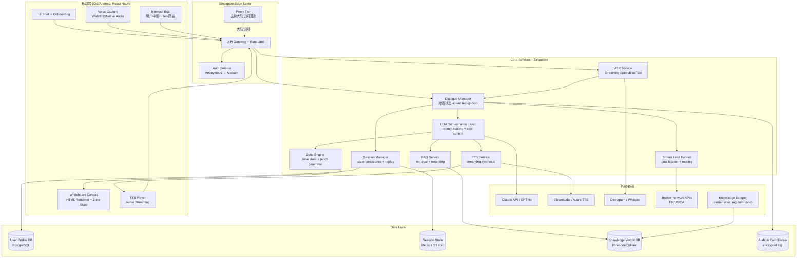
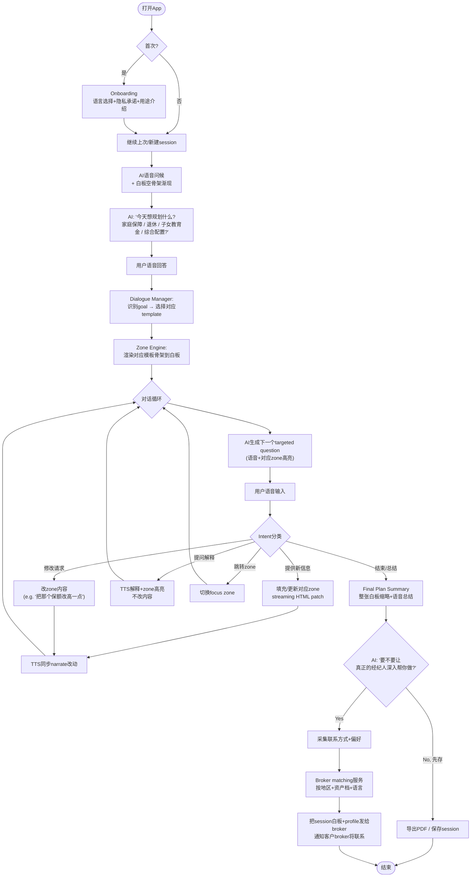

# Project: WhiteboardAdvisor (代号待定)

**版本**: v0.1 (Initial Draft)
**日期**: 2026-05-22
**作者**: Dan & Claude (协作产出)
**状态**: Discovery → 进入Engineering Spec阶段

---

## 0. TL;DR (一页纸概览)

**一句话定义**: 一款移动端独立App,通过AI在屏幕上"实时画白板+语音解说"的方式,模拟资深保险/财富经纪人的开局规划演示,面向海外华人HNW和北美mass-affluent人群。

**核心wedge**: 替代经纪人与客户首次接触时那"10分钟开局画图"环节——高频、相对标准化、高情绪价值。不替代后续的精细化配置和落地执行。

**核心范式**: AI不再以chat输出结果,而是以**streaming HTML白板 + TTS同步解说**作为primary output。用户用语音输入rough info,AI在预定义zone骨架上填充并narrate。

**关键bet**:
1. 客户面对AI比面对人类经纪人更愿意暴露rough info(已有research支撑)
2. 海外公开保单/产品数据足以爬出能启动的RAG库
3. "Visual advisor demo"格式比chat更适合保险/资产规划这种结构化决策场景
4. 通过app触达 + broker lead-gen混合变现,能跑通unit economics

**MVP目标用户**: HK华人45-60岁、可投资资产$500K-$5M、不完全信任本地RM、英语/粤语/普通话三语切换。

**Non-goals (V1不做)**:
- 不做精确账户连接(Plaid/open banking)
- 不做实际保单成交闭环
- 不做大陆境内合规
- 不做HNW($10M+)的bespoke结构化产品

---

## 1. 产品定义

### 1.1 用户故事 (Primary)

> **Henry, 52岁, 香港**, 卖掉了制造业生意,有~$3M可投资资产,三个孩子分别在多伦多/伦敦/上海。他对私人银行RM的cross-sell和discretion都有疑虑,但又不知道自己的保险/资产配置缺口在哪。某天朋友发给他WhiteboardAdvisor的链接,他在沙发上打开,对着手机说"我有3个孩子在不同国家,资产大概3百万美金,想看看怎么规划",AI在屏幕上开始画一个家庭保障结构图,边画边讲解,Henry看着画面长出来,中途打断"那个教育金部分再展开看看",AI focus到那个zone重新画一版。20分钟后Henry看到了一个方向性的规划草图,产品问他"要不要让一位专业经纪人帮你深入做一版?"——这是lead conversion点。

### 1.2 价值主张 (vs. 现状)

| 维度 | 传统人类经纪人 | WhiteboardAdvisor |
|---|---|---|
| 触达成本 | 高(关系+引荐) | 低(自助打开) |
| 信任建立 | 慢(多次见面) | 快(无人类八卦风险) |
| 时间灵活 | 需预约 | 7x24随时 |
| 心理安全 | 低(怕被推销/评价) | 高(对AI更愿暴露) |
| 知识广度 | 受限于个人经验 | 跨jurisdiction知识库 |
| 深度执行 | **强** | **弱**(此处需引回人类) |
| 个性化精度 | 高(逐个case打磨) | 中(模板+slot填充) |

→ 产品定位:**做触达和初次方向探索**;**不做深度执行**,深度执行交回broker network。

### 1.3 商业模式

**双侧变现 (Lead-gen marketplace dressed in AI)**:

1. **B2C侧**: 基础功能免费;Premium订阅($9-19/mo)解锁高级模板、PDF导出、多场景对比、家庭多人协同
2. **B2B侧 (主要收入)**: 向接入的licensed broker(HK/US/CA)收取per-qualified-lead费用($50-300/lead视客户资产档),broker获得AI生成的客户档案+session白板作为面谈起点

**为什么这个组合工作**:
- 客户付费门槛低(可投资数百万但不愿为app付太多),但他们的"intent"对broker值钱
- AI已经做完了rough qualification,broker拿到的是已经被教育过的高意向lead
- 这其实是Wealthsimple、Zoe Financial、SmartAsset的变种,只是前端体验从web form升级成了AI white board

### 1.4 与保叔的边界

- **保叔**: 飞书内嵌,B2B2C,赋能中国大陆broker
- **WhiteboardAdvisor**: 独立mobile app,B2C+B2B双向,海外市场,Singapore hosted
- **共享**: OpenClaw agent framework的底层能力、jurisdiction knowledge base可以双向沉淀
- **不共享**: 品牌、distribution、broker network、用户数据

---

## 2. 系统架构

### 2.1 整体架构图



### 2.2 模块清单与责任

| 模块 | 责任 | 技术选型建议 | 复杂度 |
|---|---|---|---|
| M1: Voice Capture | 客户端录音+VAD+streaming上传 | React Native Audio + WebRTC | 中 |
| M2: ASR Service | 多语言streaming语音识别 | Deepgram(优) / Azure / Whisper | 低(用云API) |
| M3: Dialogue Manager | 意图识别+对话状态机+zone路由 | OpenClaw agent + custom FSM | **高(核心)** |
| M4: Zone Engine | zone骨架定义+state管理+patch生成 | Custom + JSON schema | **高(核心)** |
| M5: LLM Orchestration | prompt routing+cost control+fallback | Claude API为主 + GPT-4o兜底 | 中 |
| M6: HTML Whiteboard Renderer | 客户端HTML渲染+streaming更新+动画 | React + framer-motion | **高(体验关键)** |
| M7: RAG / Knowledge Base | 检索+rerank+jurisdiction路由 | Qdrant + BGE rerank | 中 |
| M8: TTS Service | streaming语音合成+情感语气 | ElevenLabs(优) / Azure | 低 |
| M9: Session Manager | session state持久化+replay+share | PostgreSQL + S3 | 低 |
| M10: Broker Lead Funnel | qualification+matching+tracking | Custom service + CRM webhook | 中 |
| M11: Knowledge Scraper | carrier+regulator data抓取+清洗 | Python + Scrapy + LLM cleanup | 中 |
| M12: Proxy Tier (China) | 大陆访问回流(选做) | Cloudflare + 自建跳板 | 中 |

### 2.3 技术栈推荐 (Opinionated)

**前端**:
- React Native(iOS + Android一套代码)
- 渲染层用React + Tailwind生成HTML zone(因为LLM对React/Tailwind最熟练)
- 动画用framer-motion(zone填充时的"画出来"效果)
- 语音用react-native-voice + 自定义streaming

**后端**:
- Node.js/NestJS(团队栈)或Python/FastAPI
- OpenClaw作为agent framework
- WebSocket为主通道(LLM streaming + zone patch + TTS audio同步走)

**模型**:
- 主模型: Claude Sonnet 4.6 / Opus 4.7(指令遵循+HTML生成质量优)
- 备用: GPT-4o(成本/速度备份)
- ASR: Deepgram Nova(多语言+低延迟)
- TTS: ElevenLabs(自然度+情感控制最强)

**基础设施**:
- Singapore: AWS Singapore region (ap-southeast-1)
- DB: AWS RDS PostgreSQL + ElastiCache Redis + S3
- 向量库: Qdrant Cloud (Singapore)
- 监控: Datadog或自建 Prometheus + Grafana

---

## 3. 用户主流程

### 3.1 主流程图



### 3.2 关键state transitions

session有以下宏观状态:

- `INIT` → `GOAL_SETTING` → `TEMPLATE_LOADED` → `IN_DIALOGUE` (zone-by-zone loop) → `REVIEW` → `LEAD_DECISION` → `CLOSED`

每个zone内部又有sub-state: `EMPTY` → `PARTIAL` → `FILLED` → `MODIFIED` → `LOCKED`

### 3.3 异常路径 (Edge cases V1必须cover)

1. **用户中途断网**: session state每30秒autosave,回来continue
2. **用户问超出模板范围的问题**: 降级为纯chat模式in一个临时"自由对话"zone,不破坏主白板
3. **用户长时间沉默**: 60秒后AI主动问候"还在吗?需要换个话题?"
4. **用户语音识别失败**: 显示文字预测+让用户tap确认或改用键盘输入
5. **LLM生成的HTML破损**: Zone Engine做schema校验,失败则retry,2次失败则降级为简化版zone+错误日志

---

## 4. 功能模块PRD

> 下面每个模块的PRD都是engineering可以接住的颗粒度。每个模块包含: 目标、需求、输入/输出契约、关键交互、技术约束、验收标准。

---

### 4.1 模块M3: Dialogue Manager

**目标**: 维护对话状态机,理解用户语音的intent,路由到合适的下游(zone update / explanation / template switch / lead funnel)。

**关键需求**:
- 支持多轮上下文(至少20轮)
- Intent分类至少6类: `provide_info`, `modify_request`, `clarification_question`, `topic_switch`, `out_of_scope`, `terminate`
- 维护"当前focus zone"概念(用户的隐式指代解析: "把那个改成..."→哪个zone)
- 决定何时主动提问 vs 等待用户说话

**输入/输出契约**:
```typescript
// 输入
interface DMInput {
  sessionId: string
  userUtterance: string  // 来自ASR
  sessionState: SessionState
  currentZoneFocus: ZoneId | null
}

// 输出
interface DMOutput {
  intent: IntentType
  targetZone: ZoneId | null
  actionPlan: {
    type: 'update_zone' | 'modify_zone' | 'explain' | 'switch_focus' | 'ask_next' | 'finalize'
    payload: any
  }
  nextQuestion?: string  // 如果AI要主动问
}
```

**关键交互**:
- 与 Zone Engine 协作: DM决定"做什么", Zone Engine决定"怎么画"
- 与 LLM Orchestration 协作: 复杂intent判断用LLM,简单的用规则

**技术约束**:
- 单次决策延迟 < 800ms (用户感知不到等待)
- Intent分类准确率目标 > 90% (会有eval set)
- 必须有"我不懂,你能再说一遍吗"的优雅fallback

**验收标准**:
- 10个测试session,每个20+轮,intent正确率≥90%
- 用户隐式指代解析("那个"、"刚才的")正确率≥85%

---

### 4.2 模块M4: Zone Engine (核心创新点)

**目标**: 把"白板"分解为预定义的zone骨架,每个zone可以独立填充和修改,zone之间维护依赖关系。

**关键需求**:

**Zone定义** — V1为insurance/asset planning template,初步识别zone:
1. `family_profile` - 家庭成员结构图
2. `income_assets` - 收入资产盘点
3. `protection_gap` - 保障缺口分析
4. `coverage_plan` - 险种配置矩阵
5. `education_fund` - 子女教育金规划
6. `retirement_cashflow` - 退休现金流推演
7. `estate_succession` - 财富传承结构(高净值才展开)
8. `cross_border_notes` - 跨境注意事项
9. `summary_dashboard` - 总览仪表盘

**每个zone的schema**:
```typescript
interface Zone {
  id: ZoneId
  state: 'empty' | 'partial' | 'filled' | 'modified' | 'locked'
  data: ZoneData  // structured data, 不是HTML
  htmlRenderer: (data: ZoneData) => HTML  // 客户端function,纯函数
  dependencies: ZoneId[]  // 上游zone,变了我需要重算
  version: number
  lastUpdated: timestamp
}
```

**Patch生成逻辑** (核心难点):
- LLM输出structured data(JSON),不直接输出HTML
- 客户端用纯函数把data渲染为HTML
- 这样修改一个值只需要重新render该zone,不需要LLM重新生成HTML
- LLM只在"zone还需要哪些信息"和"data应该是什么"层面工作

**输入/输出契约**:
```typescript
// LLM输出
interface ZonePatch {
  zoneId: ZoneId
  operation: 'create' | 'update' | 'delete'
  data: ZoneData
  reasoning: string  // 用于TTS narrate
}

// 推送给客户端
interface ZoneUpdate {
  zoneId: ZoneId
  newHtml: string  // 客户端可以选择直接用,或自己渲染
  newData: ZoneData
  animationHint: 'grow' | 'flash' | 'morph'
}
```

**技术约束**:
- 每个zone的HTML渲染纯函数化(critical for testability)
- Zone数据schema用JSON Schema严格约束,LLM输出必须validate
- 依赖管理: 改了`income_assets`,系统提示"是否更新downstream的`protection_gap`和`retirement_cashflow`?"

**验收标准**:
- 修改一个zone不影响其他zone的DOM(用React reconciler验证)
- LLM输出的data 95%以上能通过JSON Schema校验
- Zone骨架在 < 500ms 内首次渲染完成

---

### 4.3 模块M6: HTML Whiteboard Renderer (客户端)

**目标**: 在移动端流畅呈现"AI正在画白板"的视觉体验,包括streaming更新、动画、用户tap+talk交互。

**关键需求**:
- **Streaming渲染**: zone内容分chunk到达,每个chunk有渐入动画
- **同步narrate**: TTS音频与zone内容出现时间对齐(±200ms)
- **横屏优先 + 竖屏fallback**: 白板复杂时强烈建议横屏,提示用户旋转
- **Tap-to-focus**: 用户tap某个zone,AI focus到那个zone并narrate "这部分是xxx,要改什么吗"
- **打断处理**: 用户在AI讲解中开口,立刻停止TTS、捕获语音、暂停当前动画

**交互细节**:
- Zone出现动画: "growing from corner" 或 "ink-fill" 风格,持续0.8-1.5秒
- Zone修改动画: 旧内容fade out + 新内容fade in,带高亮flash
- AI focus zone: 该zone外围加glow边框 + 略微放大
- TTS播放: 底部有waveform可视化,可暂停/重播/调速

**技术约束**:
- 60fps动画
- HTML渲染必须能在iPhone 12 / Android 中端机流畅
- Web技术栈优先(React Native WebView + React),便于AI生成内容直接用

**验收标准**:
- 在iPhone 12和小米中端机上,从zone update到画面完成 < 1.2s
- 用户tap响应延迟 < 100ms
- TTS与视觉对齐误差 < 200ms

---

### 4.4 模块M7: Knowledge Base / RAG

**目标**: 在LLM生成时提供jurisdiction-specific的事实和规则,避免confidently wrong。

**知识库内容来源** (按优先级):
1. **公开carrier产品数据**: 美国大型寿险/健康险公司的产品brochure、保单条款(可爬)
2. **监管文件**: IRS guidance, HK IA公告, Canada CRA文档
3. **税务规则**: 各jurisdiction的estate tax threshold、capital gains、RRSP/TFSA limits等
4. **经纪人playbook** (后续注入): 通过broker合作获取的真实case和方法论
5. **更新机制**: 每月增量爬取 + 关键变化人工标注

**Schema设计**:
```typescript
interface KnowledgeChunk {
  id: string
  jurisdiction: 'US' | 'HK' | 'CA' | 'global'
  category: 'product' | 'tax_rule' | 'regulation' | 'methodology'
  effectiveDate: Date
  expiryDate: Date | null  // 监管规则会过期
  embedding: number[]
  text: string
  source: string  // 必须可追溯
  confidenceLevel: 'official' | 'derived' | 'scraped'
}
```

**检索策略**:
- 按 (jurisdiction × zone_type × query) 三维路由
- 先精确过滤再向量召回
- BGE-large rerank top-20到top-5
- 任何用于生成的knowledge chunk都要在UI上有"来源"可追溯(法务保护)

**MVP范围**:
- V0.5: 仅US + HK,每个jurisdiction约 5000-10000 chunks
- V1.0: 加入Canada,引入broker注入的playbook chunks

**技术约束**:
- 检索延迟 < 300ms (并行3-5个query)
- 任何"建议买什么产品"的输出必须有knowledge chunk支撑,否则用免责语句"这是一般性思路,具体产品请咨询持牌经纪人"

---

### 4.5 模块M5: LLM Orchestration

**目标**: 统一管理对LLM的所有调用,做prompt routing、成本控制、降级。

**关键需求**:
- **多任务分流**:
  - Intent classification → 用小模型(Haiku) 或fine-tuned cheap model
  - Zone data generation → Sonnet 4.6 (质量/成本平衡)
  - Complex multi-zone planning → Opus 4.7 (重大决策)
  - TTS narration script → Sonnet 4.6
- **Cost budget per session**: 单session LLM成本目标 < $0.50, 硬上限$1.50
- **Streaming**: 所有用户感知到的输出都streaming返回
- **Caching**: 相同(template + user_profile_hash + zone_id)的输出可cache 24h(同一用户重开)

**Prompt模板架构**:
- 系统prompt = 角色定义 + jurisdiction context + zone schema + safety guardrails
- User prompt = current_zone_state + user_utterance + RAG_chunks
- Output format = JSON, strict schema

**Safety guardrails (必须有)**:
- 不给出具体股票/基金代码推荐
- 不预测市场涨跌
- 不替代税务师/律师做specific advice
- 所有建议必须以"general guidance"措辞,不用绝对化语言
- 涉及具体产品时必须附"please verify with a licensed broker"

---

### 4.6 模块M2: ASR Service

**目标**: 低延迟、多语言、抗噪的streaming语音转文字。

**关键需求**:
- 支持语言: English, 粤语, 普通话(V1必须),后续可加日语/韩语
- Streaming first-byte < 300ms
- 端点检测(VAD)精度高,不要把用户的思考停顿当作结束
- 数字/金额识别准确("三百万美金" → "$3M",  "two point five M" → "$2.5M")
- 专业术语识别("RRSP", "ULIP", "信托", "保单红利")

**技术选型对比**:
- **Deepgram**: 多语言+streaming+热词支持,推荐主选
- **Whisper (self-host)**: 准确但延迟高、不streaming-native
- **Azure Speech**: 中文识别强,可备选
- **Apple/Google native**: 客户端兜底

**降级路径**: 云ASR失败 → 客户端native ASR → 文字输入

---

### 4.7 模块M8: TTS Service

**目标**: 自然、情感丰富、与白板动作同步的语音解说。

**关键需求**:
- 多语言+多voice persona(可选: 资深绅士 / 亲切阿姨 / 专业青年)
- Streaming合成: 首字节 < 500ms
- 情感语气: 讲解严肃概念时沉稳,讲到对客户有利的部分时略上扬
- 与白板内容同步: 后端发送 "this chunk开始播放时高亮zone_3" 的对齐指令

**技术选型**:
- **ElevenLabs**: 多语言+情感+streaming最强,首选
- **Azure Neural TTS**: 中文最自然,备选
- **OpenAI TTS**: 简洁但情感弱

**Voice持久化**: 用户可以选定voice,session期间保持一致

---

### 4.8 模块M9: Session Manager

**目标**: 持久化session state,支持续航、replay、分享、broker handoff。

**关键需求**:
- Session entity包括: user_id, started_at, language, zones[], dialogue_history[], current_state, lead_status
- 自动保存频率: 每5秒 + 关键state变更时
- 支持 "Resume from session X" — 包括重新渲染所有zone到最新state
- 支持 "Share read-only link" — 客户可发给配偶或broker
- 支持 "Export PDF" — 把白板各zone渲染成有页眉的PDF

**Privacy设计**:
- 默认session 90天后归档加密,1年后可选删除
- 用户可随时delete session(硬删除,合规要求)
- 共享link有expiry,默认7天

---

### 4.9 模块M10: Broker Lead Funnel

**目标**: 把App内产生的高意向客户优雅地交接给真人经纪人,并实现variable收费。

**关键需求**:

**Lead qualification (内部打分)**:
- 资产档级(可投资资产估算)
- session深度(zone填充完成度)
- 意向强度(用户主动提出"想找人深入聊"vs"先看看")
- 地区(决定哪些broker能接)

**Broker端**:
- Broker portal(简单web后台):接收新lead通知、看到客户的白板session、决定是否claim
- Pricing tier: $50 (mass-affluent <$500K) / $150 ($500K-$2M) / $300 (HNW $2M+)
- Broker SLA: claim后48小时内必须联系客户

**用户端handoff体验**:
- "我们已为你匹配了 [broker name],她是 [city] 持牌经纪人,有 [N] 年经验。她将在48小时内联系你,届时她已经看过你今天画的规划草图。"
- 用户可以选择拒绝特定broker(隐式信号)

**反作弊**:
- 同一手机号/邮箱多次cancel计入风控
- broker端不允许直接看到客户其他渠道资料(只有session本身)

---

## 5. 数据模型 (关键entities简版)

```typescript
interface User {
  id: UUID
  createdAt: Date
  authProvider: 'anonymous' | 'apple' | 'google' | 'email'
  languagePref: string[]
  jurisdiction: string  // 用户当前所在地
  assetTier: 'mass-affluent' | 'affluent' | 'hnw' | 'unknown'  // 估算
  contactInfo?: ContactInfo  // 只在用户同意lead时填充
}

interface Session {
  id: UUID
  userId: UUID
  templateId: string  // 'family-protection' | 'retirement' | ...
  state: SessionState
  language: string
  zones: Record<ZoneId, Zone>
  dialogueHistory: DialogueEntry[]
  createdAt: Date
  lastActiveAt: Date
  leadStatus?: LeadStatus
}

interface Zone {
  id: ZoneId
  state: ZoneState
  data: ZoneData  // schema依zone type而定
  version: number
  history: ZoneSnapshot[]  // 用于撤销/replay
}

interface DialogueEntry {
  timestamp: Date
  role: 'user' | 'ai'
  content: string
  intent?: IntentType
  zoneAffected?: ZoneId
  audioRef?: string  // S3 key of audio
}

interface Lead {
  id: UUID
  sessionId: UUID
  userId: UUID
  status: 'pending' | 'matched' | 'contacted' | 'closed_won' | 'closed_lost'
  matchedBrokerId?: UUID
  tier: AssetTier
  priceCharged?: number
}

interface Broker {
  id: UUID
  name: string
  licenses: Record<Jurisdiction, License>
  languages: string[]
  specialties: string[]
  acceptedLeadTiers: AssetTier[]
}
```

---

## 6. MVP里程碑

### V0.1 — POC (4-6周, 1-2人)
**目标**: 自己能跑通core experience,自己用爽

- 单一template: family-protection(家庭保障)
- 仅英文
- 仅3个zone: family_profile, protection_gap, coverage_plan
- 仅Web端(不上mobile,降低复杂度)
- ASR/TTS用云API,不优化
- 不接broker,session end就end
- **Demo目标**: 给3个潜在用户演示,看反应

### V0.5 — Closed Beta (8-10周, 2-3人)
**目标**: 20-50个真实HK/海外华人用户用,验证核心bet

- 加入 retirement + education zones
- 加入粤语+普通话
- React Native移动端
- Singapore正式部署
- 接入1家HK broker,跑通lead handoff loop
- 引入PDF export
- 用户上限暂时按邀请码控制

### V1.0 — Public Launch (再2-3个月)
**目标**: 自助注册,真实付费/真实lead费用产生

- 全部9个zone的template完整
- 加入Canada/US的jurisdiction覆盖
- 5-10家partner broker
- Premium订阅功能上线
- 完善客服+合规审核流程
- 大陆proxy通道(选做)

---

## 7. 风险与缓解

| 风险 | 影响 | 缓解 |
|---|---|---|
| **LLM生成质量不稳定** | 客户看到confusing白板 | Zone Schema严格校验+多模型fallback+人工review抽样 |
| **HNW不信任新创App的数据安全** | 拉不到目标用户 | 显著的privacy承诺+ 数据residency document+ 找一位HK行业大咖背书 |
| **Broker network建不起来** | B2B侧无收入 | V0.5前先用1-2家friendly broker小规模验证,V1再scale |
| **ASR对粤语+多语混杂识别差** | 用户体验崩 | 早期用Deepgram + Azure双跑做A/B,选效果好的 |
| **Distribution拉不到种子用户** | 验证不了产品 | V0.1阶段就要开始 cultivate HK Chinese KOL/LinkedIn community |
| **合规越界** | 监管risk | 所有输出严格走"general guidance"措辞 + 持牌律师review + 明确免责条款 |
| **成本失控**(LLM/TTS每session贵) | unit economics崩 | session成本严格上限+ caching + 短zone优先 |
| **跟保叔资源冲突** | 主业务受拖累 | 严格作为side project, 每周固定<=10小时投入, 大模块外包 |

---

## 8. Open Questions (待Dan决定)

1. **品牌/命名**: 现在叫"WhiteboardAdvisor"是占位,正式品牌要决定。建议有英文+中文两套,适配双市场。
2. **Voice persona**: AI讲解人有几个persona(资深绅士/亲切阿姨/专业青年),默认哪个?
3. **Premium定价**: $9 vs $19 vs $29/mo?需要做几个简单的willingness-to-pay访谈
4. **Broker合作的revenue split**: lead费用收100%还是与referring broker分成?
5. **大陆proxy通道做不做**: 做了能扩大潜在用户池,不做更安全合规简单。MVP阶段建议不做。
6. **Web vs Native first**: Web端开发快但白板体验差一截;Native体验好但开发慢。建议V0.1 Web + V0.5 Native。
7. **本侧项目的资源边界**: 多少%精力,什么时候必须停掉?需要给自己一个"sunk cost断舍离"的标准。

---

## 9. 下一步动作建议

1. **Dan本人**: 确认上述Open Questions、给品牌起名、列出potential broker partner联系人
2. **Engineering**: 招1名Frontend (React Native + 动画) + 1名Backend (Node + agent framework),如果暂不招,周末自己ship V0.1
3. **Knowledge**: 启动美国carrier网站爬虫,目标2周内有第一版RAG库可测试
4. **User研究**: 找3个潜在HK target user做30分钟访谈,验证"会愿意对AI说粗略资产信息"这个假设
5. **法务**: 找一位熟悉HK/US fintech的律师,做初步合规review,2小时咨询就够给方向

---

*本文档由对话沉淀而成,不是bible。任何不合理处都应该被pressure-tested再写第二版。*
